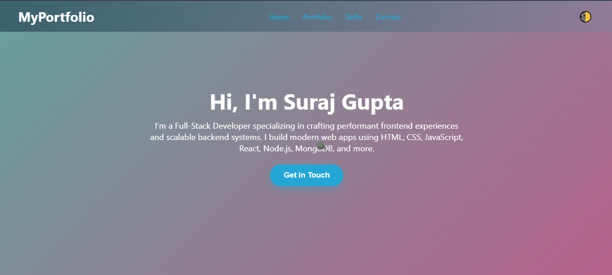

# 🌐 Suraj Gupta | Full-Stack Developer Portfolio



[](https://github.com/Suraj-Gupta-06/Portfolio-Website/commits/main)
[](https://github.com/Suraj-Gupta-06/Portfolio-Website)
[](https://github.com/Suraj-Gupta-06/Portfolio-Website)
[](https://github.com/Suraj-Gupta-06/Portfolio-Website/stargazers)
[](https://github.com/Suraj-Gupta-06/Portfolio-Website/network/members)

[](https://suraj-gupta-06.github.io/Portfolio-Website/)

A modern, responsive, and interactive portfolio website built using **HTML, CSS, and JavaScript** to showcase my projects, skills, and contact details.  

---

## 📌 Features

- 🎨 **Modern UI/UX** with smooth animations and gradient backgrounds
- 🌙 **Dark/Light Mode** toggle with saved preferences
- 📱 **Fully Responsive** for mobile, tablet, and desktop
- ✨ **Shine & Whiskers Effects** for buttons, cards, and sections
- 🖱️ **Magnetic Cursor** on larger screens
- 🎯 **Scroll Reveal** animations
- 🛠 **Animated Skills Section** with percentage rings
- 📂 **Portfolio Grid** for real-world projects
- 📩 **Contact Form** with [Web3Forms](https://web3forms.com/) integration and toast notifications
- 📜 **SEO Friendly** with meta tags, sitemap, and robots.txt

---

## 🛠 Tech Stack

- **Frontend**: HTML5, CSS3, JavaScript (Vanilla)
- **Styling**: Flexbox, Grid, Media Queries, Animations
- **Form Handling**: Web3Forms API
- **Hosting**: GitHub Pages

---

## 📂 Project Structure

```plaintext
Portfolio-Website/
│
├── index.html              # Main portfolio page
├── styles.css              # Core styling
├── main.js                 # JavaScript functionality
├── Preview.png             # Portfolio preview image
├── favicon.ico             # Favicon
├── robots.txt              # Search engine crawling rules
├── sitemap.xml             # Sitemap for SEO
├── site.webmanifest        # PWA metadata
└── README.md               # Project documentation
```
---

## 📬 Connect With Me
<p align="center">
Email    : suraj955955@gmail.com
GitHub   : https://github.com/Suraj-Gupta-06
LinkedIn : https://linkedin.com/in/suraj-gupta-
</p>

---

## 📜 License

MIT License
Copyright (c) 2025 Suraj Gupta